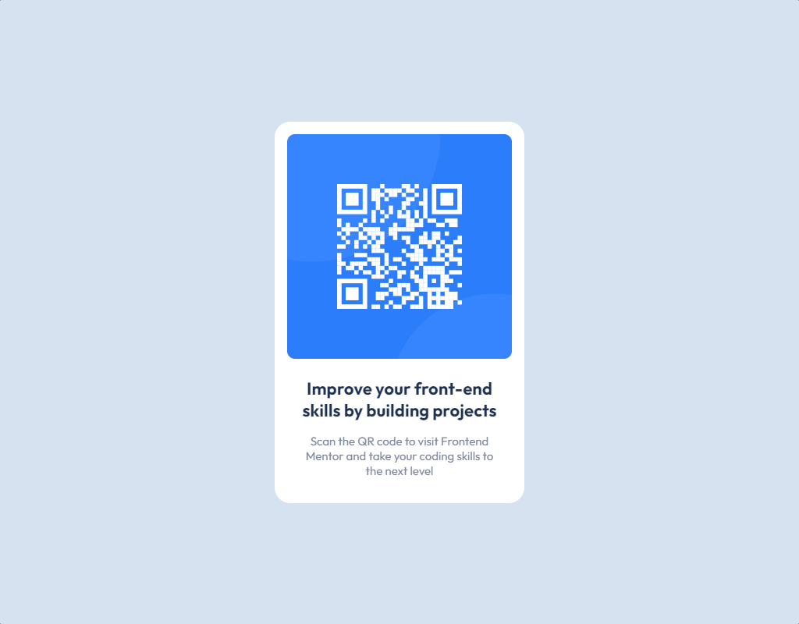

# Frontend Mentor - QR code component solução

Essa é uma solução pra o [desafio de componente de código QR do Frontend Mentor](https://www.frontendmentor.io/challenges/qr-code-component-iux_sIO_H). Desafios do Frontend Mentor ajudam você a melhorar suas habilidades de codificação criando projetos realistas. 

## Conteúdo

- [Visão Geral](#visão-geral)
  - [Screenshot](#screenshot)
  - [Links](#links)
- [Tecnologias Utilizadas](#tecnologias-utilizadas)
- [Autor](#autor)

## Visão Geral

### Screenshot

### Links

- URL da Solução: [Solução](https://www.frontendmentor.io/solutions/componente-de-cdigo-qr-criado-usando-html-e-css-flexbox-P_MzGcwFtz)
- URL do Live Site: [Github Page](https://robson-mariani.github.io/frontend-mentor-QR-code-component/)

## Tecnologias Utilizadas

- Marcação HTML5 semântica
- Propriedades personalizadas do CSS
- Flexbox

## Autor

- Frontend Mentor - [@robson-mariani](https://www.frontendmentor.io/profile/robson-mariani)
